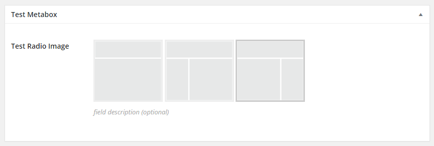

# CMB2-radio-image

Image as radio buttons

```php
add_action( 'cmb2_admin_init', 'cmb2_radio_image_metabox' );
function cmb2_radio_image_metabox() {

	$prefix = 'yourprefix_demo_';

	$cmb_demo = new_cmb2_box( array(
		'id'            => $prefix . 'metabox',
		'title'         => __( 'Test Metabox', 'cmb2' ),
		'object_types'  => array( 'page', 'post' ), // Post type
		// 'show_on_cb' => 'yourprefix_show_if_front_page', // function should return a bool value
		// 'context'    => 'normal',
		// 'priority'   => 'high',
		// 'show_names' => true, // Show field names on the left
		// 'cmb_styles' => false, // false to disable the CMB stylesheet
		// 'closed'     => true, // true to keep the metabox closed by default
	) );

	$cmb_demo->add_field( array(
		'name'             => __( 'Test Radio Image', 'cmb2' ),
		'desc'             => __( 'field description (optional)', 'cmb2' ),
		'id'               => $prefix . 'radioimg',
		'type'             => 'radio_image',
		'options'          => array(
			'full-width'    => __('Full Width', 'cmb2'),
			'sidebar-left'  => __('Left Sidebar', 'cmb2'),
			'sidebar-right' => __('Right Sidebar', 'cmb2'),
		),
		'images_path'      => get_template_directory_uri(),
		'images'           => array(
			'full-width'    => 'images/full-width.png',
			'sidebar-left'  => 'images/sidebar-left.png',
			'sidebar-right' => 'images/sidebar-right.png',
		)
	) );

}
```


## Screenshots


